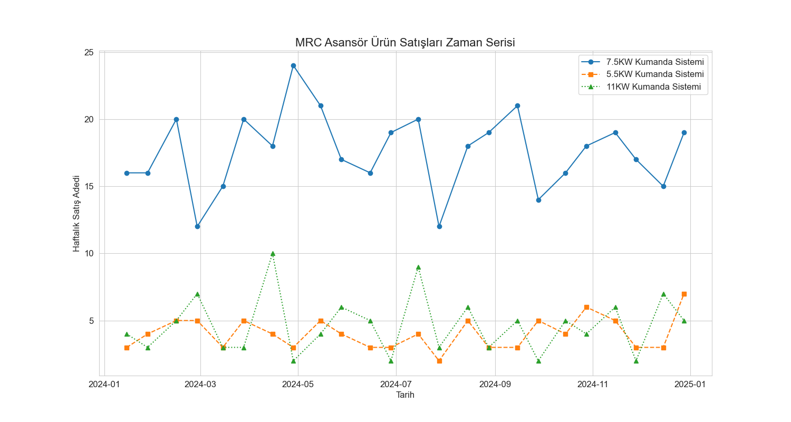
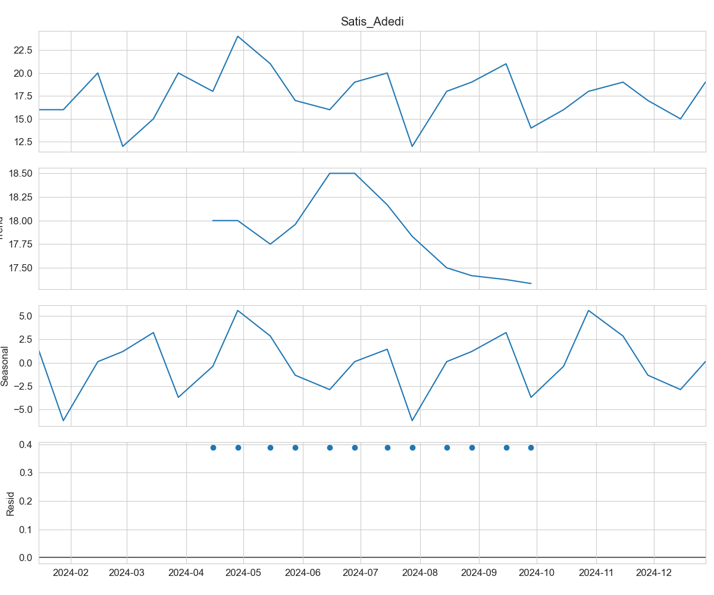

# 🏆 Bir Türk KOBİ'sinde Endüstriyel Talep Tahmini: Klasik Zaman Serisi Analizinden Yapay Zeka Modellerine Bir Vaka Çalışması

## 🌟 Proje Özeti

Bu çalışma, **MRC Asansör Mühendislik** firmasının kritik ürün talebini tahmin etmeyi amaçlamaktadır. Projenin ana amacı, kısıtlı veri koşullarında, Geleneksel yöntemlerin hata oranlarını, modern **Gelişmiş İstatistiksel** ve **Yapay Zeka** modelleriyle karşılaştırmaktır.

**Kilit Bulgu:** Proje, $n=24$ gibi kısıtlı veri setlerinde, büyük hesaplama gücü gerektiren Derin Öğrenme (LSTM) modelleri yerine, **SARIMA** gibi Gelişmiş İstatistiksel Modellerin en güvenilir çözümü sunduğunu kanıtlamıştır.

## Hazırlayan
* **Gülnaz AYDEMİR** 


## 1. Veri, Kapsam ve Özgünlük

| Kategori | Detay | Özgünlük Vurgusu |
| :--- | :--- | :--- |
| **Firma** | MRC Asansör Mühendislik / Ostim | **Gerçek KOBİ Vaka Analizi:** İnternetten alınmış değil, saha verisi. |
| **Hedef Ürün** | 7.5 KW İnverterli Kumanda Sistemi | **B2B Endüstriyel Ürün:** Tüketici değil, spesifik sanayi ürününe odaklanılmıştır. |
| **Veri Kısıtlılığı**| 24 Dönemlik (Çift Haftalık) Veri | **Kısıtlı ve Gürültülü Veri:** Literatürdeki temiz veri varsayımının aksine, bu durum modeller için teknik bir zorluk teşkil etmiştir. |
| **Baseline** | BHO/ES (Basit Hareketli Ortalama) | Mevcut en iyi performans **%14.76 MAPE**. |

***

## 2. Veri Analizi ve Problem İspatı (EDA)

### 2.1. Toplu Zaman Serisi ve Korelasyon
Verinin ne kadar oynak (volatile) olduğunu ve üç ürünün talep yapısındaki keskin iniş çıkışları gösteren genel görünüm. Bu, BHO gibi düzleştirici yöntemlerin neden başarısız olduğunu görselleştirir.


### 2.2. Bileşenlere Ayırma
Zaman serisi ayrıştırması, klasik analizlerin aksine, veride anlamlı **dalgalı Trend** ve **Mevsimsellik** sinyallerinin bulunduğunu kanıtlamıştır. Bu sinyallerin varlığı, SARIMA modelini kullanma zorunluluğumuzu destekler.


***

## 3. Modelleme ve Nihai Bulgular

### 3.1. Modeller Arası Performans Tablosu

| Model | Kategori | MAPE (OMYH) | RMSE | AIC / Bulgu |
| :--- | :--- | :--- | :--- | :--- |
| **BHO/ES (Baseline)** | Geleneksel | %14.76 | 3.20 | Başlangıç Referansı (HKO: 10.23). |
| **SARIMA** | **Gelişmiş İstatistik** | **%12.38** | **2.10** | **EN DÜŞÜK HATA ve EN İYİ UYUM** |
| **Prophet** | Makine Öğrenmesi | %34.45 | 7.67 | Veri azlığı nedeniyle **aşırı düzleştirme** ile başarısız. |
| **LSTM** | Derin Öğrenme | Uygulanamadı | Uygulanamadı | **Veri Kısıtlılığı** ($n=24$) nedeniyle matematiksel hata. |

### 3.2. SARIMA Tahmin Başarısı ve Görsel Kanıt

En iyi performansı gösteren SARIMA'nın, Gerçek Değerler'e ne kadar yaklaştığını gösteren görsel kanıt.


### 3.3. Kilit Endüstriyel Çıkarım

**KOBİ Veri Kısıtlılığı Kuralı:** Kısıtlı veriye sahip KOBİ'ler için, Yapay Zeka (LSTM, Prophet) modelleri yerine, veri yapısına odaklanan **Gelişmiş İstatistiksel Modeller (SARIMA)** en güvenilir çözümü sunmuştur.

***

## 4. Nasıl Çalıştırılır?

1.  **Gerekli Kütüphaneleri Kurun:**
    ```bash
    pip install pandas numpy matplotlib seaborn statsmodels pmdarima prophet tensorflow scikit-learn
    ```
2.  **Veri Dosyasını Hazırlayın:** Elle düzenlenmiş `MRC_Veri_Temiz.xlsx` dosyasını (Tarih, Urun_Kodu, Satis_Adedi sütunları ile) proje klasörüne yerleştirin.
3.  **Kodu Çalıştırın:** `proje_sarima.py` dosyasını çalıştırarak modelin çıktısını alabilirsiniz.

***

## LİSANS VE VERİ HAKLARI (COPYRIGHT AND DATA USAGE)

Bu projede kullanılan veriler (MRC Asansör Mühendislik firmasına ait satış verileri) **firmanın mülkiyetindedir (Proprietary Data)**.

Bu GitHub deposunun kamuya açık olması, aşağıdaki hususları gerektirir:

1.  **Veri Kısıtlılığı:** Orijinal veri seti **ticari sır** niteliği taşımakta olup, depo içinde yayınlanmamaktadır. Verilerin, proje kodları aracılığıyla dahi üçüncü taraflarca indirilmesi, kopyalanması veya ticari amaçlarla kullanılması **kesinlikle yasaktır.**
2.  **Lisans:** Projenin tüm analizi, metodolojisi ve Python kodları (`proje_sarima.py`, vb.) **Gülnaz Aydemir**'e aittir. Projenin izinsiz çoğaltılması ve ticarileştirilmesi yasaktır.

**Tüm Hakları Saklıdır (All Rights Reserved) © 2025**
